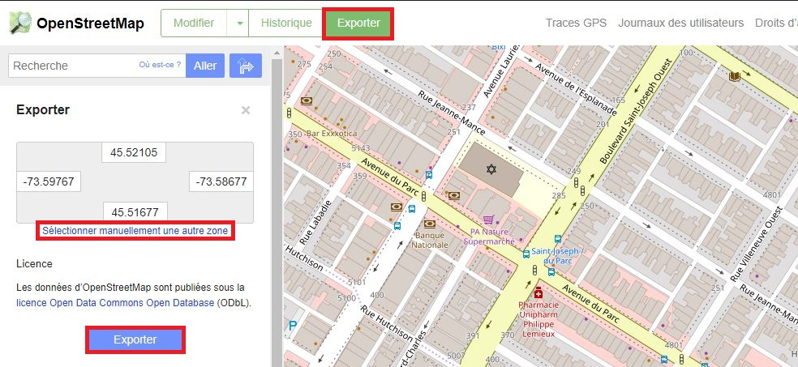
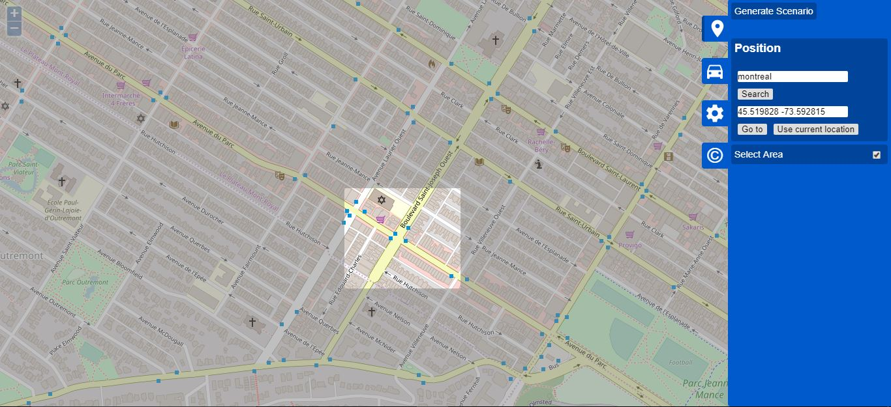

Guide pour le logiciel SUMO
==============

**Table des matières**
1. [Introduction](#introduction)
1. [Installation](#installation)
1. [Liste des outils](#liste-des-outils)
1. [Réseaux de transport](#réseaux-de-transport)
1. [Configuration des carrefours](#configuration-des-carrefours)
1. [Demande de déplacements](#demande-de-déplacements)
1. [Simulation](#simulation)
1. [Collecte de données](#collecte-de-données)
1. [Annexes](#annexes)

Ce guide est en développement actif dans le cadre du cours de Circulation CIV8740. 

# Introduction
Le logiciel [SUMO, pour "Simulation of Urban MObility",](https://www.eclipse.org/sumo/) est un logiciel de simulation microscopique de la circulation dont le code est sous license libre ("open source"). Il permet de représenter les réseaux de transport terrestre, en particulier la circulation routière. Il est développé par l'[agence aérospatiale allemande DLR](https://www.dlr.de). Ce guide se concentrera sur les déplacements des véhicules motorisés et cyclistes, mais SUMO peut aussi représenter les déplacements piétons et le transport en commun. 

La plupart des fichiers sont des fichiers textes suivant le format "Extensible Markup Language" (XML), soit "langage de balisage extensible", qui est un métalangage informatique de balisage générique (voir https://fr.wikipedia.org/wiki/Extensible_Markup_Language). Assurez-vous d'avoir un bon éditeur texte pour éditer ces fichiers directement, par exemple [Notepad++](https://notepad-plus-plus.org/) sur Windows, [Atom](https://atom.io/) ou [emacs](https://www.gnu.org/software/emacs/) sur toutes les plateformes. Il est **très important** d'avoir des [compétences informatiques minimales](https://sumo.dlr.de/docs/Basics/Basic_Computer_Skills.html) de manipulation des fichiers textes, du format XML et de l'utilisation d'outils en ligne de commande pour utiliser SUMO.

La documentation de référence de SUMO est en anglais et est disponible [en ligne](https://sumo.dlr.de/docs/), ainsi qu'un [glossaire](https://sumo.dlr.de/docs/Other/Glossary.html). Plusieurs tutoriels en anglais sont aussi [disponibles](https://sumo.dlr.de/docs/Tutorials.html).


# Installation
La documentation décrit comment [installer](https://sumo.dlr.de/docs/Installing.html) SUMO, y compris les différents outils logiciels. Ils sont installés dans un nouveau répertoire qui dépend de votre choix et du sytème d'exploitation. Plusieurs autres [outils](https://sumo.dlr.de/docs/Tools.html) en ligne de commande dépendent de la bonne configuration de les variables d'environnement `PATH` et `SUMO_HOME` pour pouvoir les utiliser simplement. La [documentation explique](https://sumo.dlr.de/docs/Basics/Basic_Computer_Skills.html#sumo_home) comment configurer ces variables. 


# Liste des outils
De nombreux outils ([liste complète](https://sumo.dlr.de/docs/Sumo_at_a_Glance.html#included_applications)) sont disponibles dans SUMO, parmi lesquels les plus utilisés seront:
* [netedit](https://sumo.dlr.de/docs/NETEDIT): outil graphique d'édition du réseau, de la demande et d'autres attributs de la simulation 
* [netconvert](https://sumo.dlr.de/docs/NETCONVERT): outil en ligne de commande de conversion des éléments de réseau au format SUMO
* [netgenerate](https://sumo.dlr.de/docs/NETGENERATE.html): outil en ligne de commande de génération de réseaux abstraits
* plusieurs outils d'affectation de la demande au réseau comme duarouter, jtrrouter, etc.
* [sumo-gui](https://sumo.dlr.de/docs/SUMO-GUI.html): interface graphique de simulation
* [sumo](https://sumo.dlr.de/docs/SUMO.html): outil en ligne de commande de simulation
* plusieurs outils comme des scripts Python pour faciliter la création de fichier ou leur conversion, disponibles dans le répertoire `tools` du dossier `Sumo` (répertoire d'installation sur Windows, `/usr/share/sumo/` sur Linux). 

Le processus général pour construire un scénario SUMO est décrit dans un [tutoriel](https://sumo.dlr.de/docs/Tutorials/ScenarioGuide.html). Les deux tutoriels suivant montrent pas à pas comment construire un petit scénario SUMO:
* ["Hello World"](https://sumo.dlr.de/docs/Tutorials/Hello_World.html)
* ["Quick start"](https://sumo.dlr.de/docs/Tutorials/quick_start.html)

Un scénario nécessite au moins les fichiers suivants: 
* un fichier de configuration de SUMO, avec extension `.sumocfg`;
* un réseau routier, avec extension `.net.xml`;
* un fichier de demande de déplacements, incluant des itinéraires, avec extension `.rou.xml`.
Tous ces fichiers sont au format texte XML. Il est possible d'exécuter une simulation avec les outils sumo ou sumo-gui, en leur indiquant directement d'utiliser les fichiers réseau et demande, ou en utilisant un fichier de configuration qui fait référence à ces deux fichiers et inclue d'autres paramètres de simulation. Cela est présenté en détail dans la section [Simulation](#simulation).

# Réseaux de transport
Il existe différentes façons de créer ou importer des réseaux de transport dans SUMO. Une des forces est la facilité d'importer des données d'[OpenStreetMap](https://www.openstreetmap.org/). 

La configuration des carrefours (mouvement permis, priorités et types de contrôle) sera abordée dans la [section suivante](#configuration-des-carrefours). 

Un réseau SUMO est constitué de liens ("edge"), une ou plusieurs voies ("lane") par lien, de carrefours ("junction") et de connections ("connection") entre liens. Ces éléments et leur format sont décrits dans la [documentation](https://sumo.dlr.de/docs/Networks/SUMO_Road_Networks.html).

## Attributs des liens et carrefours
Le format de réseau de transport de SUMO n'est pas fait pour être édité manuellement. Pour éditer les fichiers du réseau, la procédure recommandée consiste à utiliser [netconvert](https://sumo.dlr.de/docs/NETCONVERT.html) pour convertir le réseau en [format XML simple](https://sumo.dlr.de/docs/Networks/PlainXML.html), à éditer ces fichiers, puis à utiliser de nouveau netconvert pour reconstruire le réseau ensuite. 

Un exemple est la construction du réseau jouet "hello" utilisé comme exemple dans ce guide, disponible dans le [répertoire sumo](sumo). Ce réseau est constitué 
* de quatre carrefours ("noeuds") (fichier `hello.nod.xml`):
```xml
<nodes>
  <node id="1" x="-250.0" y="0.0" />
  <node id="2" x="+250.0" y="0.0" />
  <node id="3" x="+500.0" y="100.0" />
  <node id="4" x="+500.0" y="-100.0" />
</nodes>
```
* et de trois liens (fichier `hello.edg.xml`):
```xml
<edges>
    <edge from="1" id="1to2" to="2" />
    <edge from="2" id="2to3" to="3" />
    <edge from="2" id="2to4" to="4" />
</edges>
```
Ces deux fichiers sont ensuite combinés dans un fichier réseau avec netconvert:
```$ netconvert --node-files=hello.nod.xml --edge-files=hello.edg.xml --output-file=hello.net.xml```

Les attributs des éléments du réseau sont définis dans la page sur le [format XML simple](https://sumo.dlr.de/docs/Networks/PlainXML.html). Les attributs possibles d'un carrefour sont décrits dans le tableau suivant. 

| Attribute Name  | Value Type                                | Description                  |
| --------------- | ---------------------------------------------------------------------------- | ------------------------------------------------------------------------- |
| **id**          | id (string)                                                                                                                                                                                                               | The name of the node                                                                                                                               |
| **x**           | float                                                                                                                                                                                                                     | The x-position of the node on the plane in meters                                                                                                  |
| **y**           | float                                                                                                                                                                                                                     | The y-position of the node on the plane in meters                                                                                                  |
| z               | float                                                                                                                                                                                                                     | The z-position of the node on the plane in meters                                                                                                  |
| type            | enum ( "priority", "traffic_light", "right_before_left", "unregulated", "priority_stop", "traffic_light_unregulated", "allway_stop", "rail_signal", "zipper", "traffic_light_right_on_red", "rail_crossing") | An optional type for the node                                                                                                                      |
| tlType          | enum ( "static", "actuated")                                                                                                                                                                                              | An optional type for the traffic light algorithm                                                                                                   |
| tl              | id (string)                                                                                                                                                                                                               | An optional id for the traffic light program. Nodes with the same tl-value will be joined into a single program                                    |
| radius          | positive float;                                                                                                                                                                                                           | optional turning radius (for all corners) for that node in meters *(default 1.5)*                                                                  |
| shape           | List of positions; each position is encoded in x,y or x,y,z in meters (do not separate the numbers with a space\!).                                                                                                       | A custom shape for that node. If less than two positions are given, netconvert will reset that node to use a computed shape.                       |
| keepClear       | bool                                                                                                                                                                                                                      | Whether the [junction-blocking-heuristic](../Simulation/Intersections.md#junction_blocking) should be activated at this node *(default true)* |
| rightOfWay      | string                                                                                                                                                                                                                    | Set algorithm for computing [\#Right-of-way](#right-of-way). Allowed values are *default* and *edgePriority*                            |
| controlledInner | list of edge ids                                                                                                                                                                                                          | Edges which shall be controlled by a joined TLS despite being incoming as well as outgoing to the jointly controlled nodes                         |

Les attributs possibles d'un lien sont décrits dans le tableau suivant.

| Attribute Name | Value Type                                        | Description                                        |
| -------------- | ------------------------------------- | -------------------------------------------------------------- |
| **id**         | id (string)                           | The id of the edge (must be unique)                            |
| from           | referenced node id                    | The name of a node within the nodes-file the edge shall start at    |
| to             | referenced node id                    | The name of a node within the nodes-file the edge shall end at      |
| type           | referenced type id                    | The name of a type within the [SUMO edge type file](../SUMO_edge_type_file.md)  |
| numLanes       | int                                   | The number of lanes of the edge; must be an integer value                       |
| speed          | float                                 | The maximum speed allowed on the edge in m/s; must be a floating point number (see also "Using Edges' maximum Speed Definitions in km/h")  |
| priority       | int                                   | The priority of the edge. Used for [\#Right-of-way](#right-of-way)-computation            |
| length         | float                                 | The length of the edge in meter                                                     |
| shape          | List of positions; each position is encoded in x,y or x,y,z in meters (do not separate the numbers with a space\!). | If the shape is given it should start and end with the positions of the from-node and to-node. Alternatively it can also start and end with the position where the edge leaves or enters the junction shape. This gives some control over the final junction shape. When using the option **--plain.extend-edge-shape** it is sufficient to supply inner geometry points and extend the shape with the starting and ending node positions automatically |
| spreadType     | enum ( "right", "center", "roadCenter")                                                                                          | The description of how to compute lane geometry from edge geometry. See [SpreadType](#spreadtype)  |
| allow          | list of vehicle classes               | List of permitted vehicle classes (see [access permissions](#road_access_permissions_allow_disallow))       |
| disallow       | list of vehicle classes               | List of forbidden vehicle classes (see [access permissions](#road_access_permissions_allow_disallow))       |
| width          | float                                 | lane width for all lanes of this edge in meters (used for visualization)                                    |
| name           | string                                | street name (need not be unique, used for visualization)                                                    |
| endOffset      | float \>= 0                           | Move the stop line back from the intersection by the given amount (effectively shortening the edge and locally enlarging the intersection)  |
| sidewalkWidth  | float \>= 0                           | Adds a sidewalk with the given width (defaults to -1 which adds nothing).                              |

Les attributs possibles d'une connection sont décrits dans le tableau suivant.

| Attribute Name | Value Type                             | Default | Description      |
| -------------- | -------------------------------------- | ------- | ----------------------------------------------------------------------- |
| **from**       | referenced edge id                                                                                                  |         | The name of the edge the vehicles leave                                                                                                                                                                                                                                                                                                                                      |
| to             | referenced edge id                                                                                                  |         | The name of the edge the vehicles may reach when leaving "from"                                                                                                                                                                                                                                                                                                              |
| fromLane       | *<INT\>*                                                                                                             |         | the lane index of the incoming lane (numbers starting with 0)                                                                                                                                                                                                                                                                                                                |
| toLane         | *<INT\>*                                                                                                             |         | the lane index of the outgoing lane (numbers starting with 0)                                                                                                                                                                                                                                                                                                                |
| pass           | bool                                                                                                                | false   | if set, vehicles which pass this (lane-2-lane) connection) will not wait                                                                                                                                                                                                                                                                                                     |
| keepClear      | bool                                                                                                                | true    | if set to *false*, vehicles which pass this (lane-2-lane) connection) will not worry about [blocking the intersection](../Simulation/Intersections.md#junction_blocking).                                                                                                                                                                                               |
| contPos        | float                                                                                                               | \-1     | if set to 0, no [internal junction](../Networks/SUMO_Road_Networks.md#internal_junctions) will be built for this connection. If set to a positive value, an internal junction will be built at this position (in m) from the start of the internal lane for this connection.                                                                                            |
| visibility     | float                                                                                                               | 4.5     | specifies the distance to the connection \[in m.\] below which an approaching vehicle has full sight of any other approaching vehicles on the connection's foe lanes (i.e. vehicle can accelerate if none are present). Note, that a too low visibility (<=0.1m.) will prevent vehicles from crossing a minor link. For major links the attribute has no effect, currently. |
| speed          | float                                                                                                               | \-1     | specifies the maximum speed while moving across the intersection using this connection (in m/s). By default the mean speed of the edge before and after the connection is used. With the default value, the speed is set to the average of the incoming and outgoing lane or to a radius based limit if option **--junctions.limit-turn-speed** is set.                                                      |
| shape          | List of positions; each position is encoded in x,y or x,y,z in meters (do not separate the numbers with a space\!). |         | specifies a custom shape for the internal lane(s) for this connection. By default an interpolated cubic spline is used.                                                                                                                                                                                                                                                      |
| uncontrolled   | bool  | false   | if set to *true*, This connection will not be TLS-controlled despite its node being controlled. |
| allow     | list of vehicle classes    |    | set custom permissions independent of from-lane and to-lane permissions. |
| disallow  | list of vehicle classes    |    | set custom permissions independent of from-lane and to-lane permissions. |


## Importer un réseau d'OpenStreetMap
Il existe deux méthodes pour importer des données d'[OpenStreetMap](https://www.openstreetmap.org/). 

### Téléchargement d'OpenStreetMap et importation simple
La méthode consiste à naviguer sur le site d'[OpenStreetMap](https://www.openstreetmap.org/), trouver la zone dont on désire importer les données et à les exporter en cliquant sur le bouton tel que montré dans l'image ci-dessous. 



Si vous connaissez déjà les coordonnées (latitude, longitude) de la zone d'intérêt, il est possible d'y accéder directement via le navigateur avec une adresse du type https://overpass-api.de/api/map?bbox=-73.7754,45.5628,-73.7653,45.5691, ou via l'outil `wget` en ligne de commande: ```$ wget -O map.osm "https://overpass-api.de/api/map?bbox=-73.7754,45.5628,-73.7653,45.5691"```

Le fichier obtenu `.osm` peut être soit importé directement par netedit, soit converti en fichier réseau SUMO `.net.xml` avec l'utilitaire en ligne de commande netconvert. Les options de netconvert discutées ci-dessous sont disponibles dans plusieurs onglets lors de l'importation par netedit. 

La commande netconvert est la suivante: ```$ netconvert --geometry.remove --remove-edges.isolated --junctions.join --osm map.osm -o map.net.xml```. Les options `--geometry.remove` et `--junctions.join` ont pour effets respectifs de simplifier la géométrie du réseau sans changer sa topologie et de consolider les carrefours proches, par exemple d'une route séparée en deux par une médiane dans OSM, ce qui donnerait deux carrefours rapprochés (l'option --junctions.join-dist contrôle le seuil de distance pour fusionner deux carrefours). L'option `--remove.edges.isolated` permet d'éliminer les tronçons isolés. D'autres options sont décrites dans la documentation de SUMO ([options recommandées](https://sumo.dlr.de/docs/Networks/Import/OpenStreetMap.html#Recommended_NETCONVERT_Options)). Il est aussi possible d'utiliser des [typemaps](https://sumo.dlr.de/docs/Networks/Import/OpenStreetMap.html#recommended_typemaps) lorsque des données comme les limites de vitesse sont manquantes. 

Lors de la conversion d'un fichier `.osm` en réseau SUMO, il est possible de ne garder qu'un seul type de route avec la commande ```$ netconvert --osm-files map.osm  --keep-edges.by-type highway.motorway,highway.primary,highway.secondary,highway.tertiary,highway.trunk,highway.primary_link,highway.secondary_link,highway.tertiary_link,highway.motorway_link,highway.residential -o map.net.xml``` ou de sélectionner les routes selon les types d'usagers qui y circulent avec la commande ```$ netconvert --osm-files map.osm --remove-edges.by-vclass pedestrian,bicycle,delivery -o map.net.xml``` (les pistes cyclables et autres routes reservées aux piétons et à la livraison sont supprimés).

Les [types de route](https://sumo.dlr.de/docs/SUMO_edge_type_file.html) permettent de gérer des attributs communs à un ensemble de lien, et correspondent souvant dans la réalité à des catégories ou classes de route. 

D'autres commandes permettent de deviner le bon sens de circulation au niveau des ronds points avec `--roudabouts.guess` ou de les bretelles d'entrée et de sortie d'autoroutes si elles manquent avec `--guess.ramps`. 

### Script intégré d'importation
Le script [`osmWebWizard.py`](https://sumo.dlr.de/docs/Tutorials/OSMWebWizard.html) situé dans le répertoire `tools` permet d'importer des données d'OpenStreetMap et de générer une demande de déplacement via une interface Internet. 



Après génération du scénario, il est automatiquement ouvert dans sumo-gui. Il est généralement nécessaire de retoucher le réseau avec netedit. Tous les fichiers sont sauvés dans un répertoire au format du jour et de l'heure du type `yyyy-mm-dd-hh-mm-ss`. 

## Créer un réseau géométrique
Il est possible de générer des réseaux géométriques avec l'outil [netgenerate](https://sumo.dlr.de/docs/NETGENERATE.html) en ligne de commande,  en forme 
* de toile d'araignée: ```$ netgenerate -s --spider.arm-number 10 -o network.net.xml```
* de grille: ```$ netgenerate -g --grid.number 10 -o network.net.xml```
* de réseau aléatoire: ```$ netgenerate -r --rand.iterations 2000 -o network.net.xml```

## Créer et modifier un réseau
Un réseau peut être créé à partir de rien et modifié avec l'outil [netedit](https://sumo.dlr.de/docs/NETEDIT.html). La page de l'outil inclut un guide d'utilisation avec des vues de l'interface. Le tutoriel ["Quick start"](https://sumo.dlr.de/docs/Tutorials/quick_start.html) comprend aussi des explications pas à pas pour utiliser netedit. netedit a plusieurs modes et les actions effectuées à la souris dépendent du mode sélectionné: "inspect", "delete", "select", "move", etc. Un aspect intéressant du mode "inspect" est qu'il permet de voir les attributs des éléments d'un réseau, mais aussi d'éditer ces attributs: il est par exemple possible de modifier les coordonnées de noeuds ou le nombre de voies d'un lien directement de cette façon. 

Il faut aussi noter que netedit permet depuis peu de créer la demande de déplacement vue [ci-dessous](#demande-de-déplacements). 

# Configuration des carrefours
Pour cette section, on crée un petit carrefour à quatre branches, avec une voie dans chaque direction, sans mouvement interdit hormis les demi-tours. Le réseau jouet `carrefour` est disponible dans le [répertoire sumo](sumo). Il est constitué 
* de cinq carrefours ("noeuds") (fichier `carrefour.nod.xml`):
```xml
<nodes>
  <node id="center" x="0.0" y="0.0" />
  <node id="east" x="100.0" y="0.0" />
  <node id="north" x="0.0" y="100.0" />
  <node id="west" x="-100.0" y="0.0" />
  <node id="south" x="0.0" y="-100.0" />
</nodes>
```
* et de huit liens (fichier `carrefour.edg.xml`):
```xml
<edges>
    <edge from="center" id="outwest" to="west" />
    <edge from="center" id="outeast" to="east" />
    <edge from="center" id="outnorth" to="north" />
    <edge from="center" id="outsouth" to="south" />
    <edge from="west" id="inwest" to="center" />
    <edge from="east" id="ineast" to="center" />
    <edge from="north" id="innorth" to="center" />
    <edge from="south" id="insouth" to="center" />
</edges>
```
Ces deux fichiers sont ensuite combinés dans un fichier réseau avec netconvert: ```$ netconvert --node-files=carrefour.nod.xml --edge-files=carrefour.edg.xml --output-file=carrefour.net.xml --no-turnarounds true```

Ajouter l'option ` --no-internal-links` simplifie le réseau pour de grands réseaux, mais fait que les véhicules "sautent" le centre du carrefour lorsqu'ils le traversent. Dans ce cas, la distance parcourue, et donc le temps de parcours, sont réduits de façon irréaliste et d'[autres phénomènes](https://sumo.dlr.de/docs/Simulation/Intersections.html), comme l'attente des véhicules dans le carrefour, ne peuvent être reproduits. 

## Types de carrefours
Il existe trois niveaux de contrôle à un carrefour: 
* les règles de la route (par défaut);
* l'attribution explicite de la priorité par un panneau de cédez le passage ou d'arrêt;
* les feux de circulation.

Les types de carrefours (attribut `type` d'un élément node ou junction) sont les suivants (s'il n'est pas précisé dans le fichier des carrefours `nod.xml`, il sera deviné par netconvert):
* `priority`: les véhicules sur un lien à basse priorité doivent attendre jusqu'à ce que les véhicules sur un lien à priorité élevée aient passé le carrefour;
* `traffic_light`: le carrefour est contrôlé par des feux de circulation (les règles de priorité sont utilisées pour éviter les collisions si des liens en conflit sont vert en même temps);
* `right_before_left`: les véhicules laissent passer ceux qui viennent à leur droite;
* `unregulated`: le carrefour n'a pas de contrôle, les véhicules passent sans freiner, la détection de collision dans le carrefour ne fonctionne pas et des collisions peuvent se produire en dehors du carrefour;
* `traffic_light_unregulated`: le carrefour est contrôlé par des feux de circulation sans autre règle, ce qui peut causer des collisisons dans le carrefour si des plans de feux non-sécuritaires sont utilisés (les collisions dans le carrefour ne sont pas détectées);
* `priority_stop`: ce type fonctionne comme un carrefour de type `priority` où les véhicules arrivant sur la route secondaire doivent s'arrêter avant de passer;
* `allway_stop`: un carrefour de ce type est contrôlé par un [arrêt toute direction](https://en.wikipedia.org/wiki/All-way_stop);
* `rail_signal`: ce carrefour est contrôlé par un [feu de chemin de fer](https://sumo.dlr.de/docs/Simulation/Rail_signals.html) (seulement utile pour des chemins de fer);
* `zipper`: ce carrefour connecte les liens où le nombre de voie diminue et la circulation doit converger comme une "fermeture éclar" ([zipper-style (late merging)](https://en.wikipedia.org/wiki/Merge_%28traffic%29));
* `rail_crossing`: ce type de carrefour représente un passage à niveau permettant aux trains de passer dans s'arrêter grâce à des feux de circulation quand le train approche;
* `traffic_light_right_on_red`: le carrefour est contrôlé par des feux de circulation comme pour le carrefour de type `traffic_light`, en autorisant en plus le virage à droite au feu rouge (les véhicules doivent s'arrêter, puis peuvent tourner dans n'importe quelle phase si le mouvement est sécuritaire) (
  [right-turn-on-red](https://en.wikipedia.org/wiki/Right_turn_on_red)).

Les priorités de chaque approche sont représentées par la [couleur de la ligne d'arrêt dans sumo-gui](https://sumo.dlr.de/docs/SUMO-GUI.html#right_of_way). La priorité sera calculée à chaque carrefour selon son type. Pour les types `priority` et `priority_stop`, elle dépend des valeur des attributs "priority" des liens entrants (approches) et sortants (sorties), de la vitesse et du nombre de voies. La priorité peut aussi être modifiée via des [prohibitions de connections](https://sumo.dlr.de/docs/Networks/PlainXML.html#setting_connection_priorities) et l'attribut "pass" de connection (les véhicules sur cette connection ne s'arrêtent pas). Les deux méthodes pour déterminer la priorité d'un carrefour dépendent de l'attribut `rightOfWay` du carrefour:
* `rightOfWay="default"`: les liens sont classés en fonction de leur priorité (attribut `priority`), limite de vitesse (attribut "speed") et nombre de voies (attribut "laneNumber"). Les deux premiers liens entrants ont la priorité et les autres liens sont secondaires;
* `rightOfWay="edgePriority"`: seul l'attribut `priority` des liens est considéré; en cas d'égalité, les types de mouvements (virages) sont aussi considérés.

Dans le cas d'un [carrefour giratoire](https://sumo.dlr.de/docs/Networks/PlainXML.html#roundabouts), les liens dans le carrefour auront toujours la priorité. Dans le cas d'une restriction du nombre de voies, la priorité est la même dans le cas d'un carrefour de type `zipper`; sinon, la voie de gauche a priorité sur la voie de droite.

<!-- requests (responses, foes) and internal junctions are not for manual manipulation -->

## Carrefours à feux
La façon recommandée de créer un [carrefour contrôlé par des feux de circulation et son plan de feu](https://sumo.dlr.de/docs/Simulation/Traffic_Lights.html) est d'utiliser netedit. Il faut changer le type de carrefour ou choisir le mode d'édition des feux de circulation, cliquer sur le carrefour et créer un plan de feu. On crée ainsi un [plan de feu par défaut](https://sumo.dlr.de/docs/Simulation/Traffic_Lights.html#automatically_generated_tls-programs) avec les caractéristiques suivante: cycle de 90 s par défaut, partage égal du temps de vert entre les phases, suivi par une phase jaune, les virages à gauche permis si la limite de vitesse est inférieure à 70 km/h, une phase protégée pour les virages à gauche si une voie réservée existe et un décalage de 0. Alternativement, il est possible de choisir un plan de feux où chaque approche a sa phase l'une après l'autre (option `--tls.layout incoming`, la valeur par défaut étant `opposites`). Si le carrefour a plus d'approches, des phases seront ajoutées. 

Le plan de feu est représenté par un élément `tlLogic` qui peut être enregistré dans un fichier réseau `net.xml` ou dans un fichier additionnel. Il a les attributs décrits dans le tableau suivant. 

| Attribut | Type de valeur                            | Description      |
| -------------- | ------------------------------------- | ---------------- |
| **id**         | id (string)                           | The id of the traffic light. This must be an existing traffic light id in the .net.xml file. Typically the id for a traffic light is identical with the junction id. The name may be obtained by right-clicking the red/green bars in front of a controlled intersection. |
| **type**       | enum (static, actuated, delay_based) | The type of the traffic light (fixed phase durations, phase prolongation based on time gaps between vehicles (actuated), or on accumulated time loss of queued vehicles (delay_based) )                                                                                  |
| **programID**  | id (string)                           | The id of the traffic light program; This must be a new program name for the traffic light id. Please note that "off" is reserved, see below.                                                                                                                             |
| **offset**     | int                                   | The initial time offset of the program |

Chaque phase a les attributs décrits dans le tableau suivant. 

| Attribut | Type de valeur             | Description                |
| -------------- | --------------------- | -------------------------- |
| **duration**   | time (int)            | The duration of the phase                                                                                                                                    |
| **state**      | list of signal states | The traffic light states for this phase, see below                                                                                                           |
| minDur         | time (int)            | The minimum duration of the phase when using type **actuated**. Optional, defaults to duration.                                                              |
| maxDur         | time (int)            | The maximum duration of the phase when using type **actuated**. Optional, defaults to duration.                                                              |
| name           | string                | An optional description for the phase. This can be used to establish the correspondence between SUMO-phase-indexing and traffic engineering phase names.     |
| next           | list of phase indices (int ...)           | The next phase in the cycle after the current. This is useful when adding extra transition phases to a traffic light plan which are not part of every cycle. Traffic lights of type 'actuated' can make use of a list of indices for selecting among alternative successor phases. |

Seuls les attributs `duration` et `state` sont requis pour un plan de feu à temps fixe, les autres paramètres servant pour les feux semi-adaptatifs. Dans SUMO, chaque changement d'état (par exemple passage au jaune) d'un feu correspond à une nouvelle phase pour le carrefour, à la différence des définitions en circulation. Les phases se succèdent dans le temps, l'attribut `state` indiquant l'état du feu pour chaque connection entre toutes les voies arrivant et partant du carrefour. Il y a autant de caractères dans l'attribut `state`, constituant un vecteur d'état, que de connections dans le carrefour, commençant par l'approche à `midi` (sur un quadrant de montre) avec les virages à droite, les mouvements tout droit et les virages à gauche (les id des connections sont visibles dans sumo-gui avec l'option "show link tls index"). Les états des feux sont représentés par un caractère défini dans le tableau suivant:

| Character | GUI Color                                                  | Description          |
| --------- | ---------------------------------------------------------- | -------------------- |
| r         | rouge | 'red light' for a signal - vehicles must stop     |
| y         | jaune | 'amber (yellow) light' for a signal - vehicles will start to decelerate if far away from the junction, otherwise they pass    |
| g         | vert | 'green light' for a signal, no priority - vehicles may pass the junction if no vehicle uses a higher priorised foe stream, otherwise they decelerate for letting it pass. They always decelerate on approach until they are within the configured [visibility distance](../Networks/PlainXML.md#explicitly_setting_which_edge_lane_is_connected_to_which) |
| G         | vert foncé | 'green light' for a signal, priority - vehicles may pass the junction                                                                                                                                                                                                                                                                                                                                 |
| s         | mauve | 'green right-turn arrow' requires stopping - vehicles may pass the junction if no vehicle uses a higher priorised foe stream. They always stop before passing. This is only generated for junction type *traffic_light_right_on_red*.                                                                                                                                                             |
| u         | orange foncé | 'red+yellow light' for a signal, may be used to indicate upcoming green phase but vehicles may not drive yet (shown as orange in the gui)                                                                                                                                                                                                                                                             |
| o         | marrond | 'off - blinking' signal is switched off, blinking light indicates vehicles have to yield                                                                                                                                                                                                                                                                                                              |
| O         | cyan | 'off - no signal' signal is switched off, vehicles have the right of way|

TODO ajouter un exemple

Les phases peuvent être visualisées dans netedit en sélectionnant les états, et dans sumo-gui par un clic droit sur une ligne de feu et en sélectionnant "show phases". Le plan de feu est indiqué dans chaque connection par l'attribut "tl". Il est possible de regrouper les connections en leur donnant le même indice dans le vecteur d'état avec l'attribut "linkIndex" (voir exemple dans le [répertoire sumo](sumo)). 

Les [feux semi-adaptatifs](https://sumo.dlr.de/docs/Simulation/Traffic_Lights.html#actuated_traffic_lights) peuvent aussi être représentés en ajoutant des capteurs sur les approches. 

# Demande de déplacements
Dans SUMO, un véhicule est défini par trois éléments: 
* un type de véhicule qui décrit ses propriétés physiques;
* l'itinéraire que le véhicule suivra;
* le véhicule lui-même.

Un déplacement ("trip") correspond au déplacement d'un véhicule d'un endroit à un autre, défini par un lien de départ, un lien d'arrivée et un instant de départ. Un itinéraire ("route") est un déplacement généralisé, c'est-à-dire une définition d'itinéraire qui contient non seulement les liens de départ et d'arrivée, mais aussi les liens par lesquels le véhicule passera. 

## Définition des véhicules et itinéraires
Une simulation SUMO a besoin d'itinéraires pour les déplacements des véhicules. Il peuvent être générés de [différentes façons](https://sumo.dlr.de/docs/Demand/Introduction_to_demand_modelling_in_SUMO.html). Ces éléments sont définis dans un fichier de demande de déplacement `.rou.xml`, par exemple `hello.rou.xml` pour notre exemple (voir la section [Simulation](#simulation) pour le fichier de configuration sumo `.sumocfg` nécessaire pour exécuter une simulation avec ce fichier d'itinéraires et le fichier du réseau).

Une première façon consiste à définir un véhicule avec un itinéraire (pour lui seulement): 
```xml
<routes>
  <vehicle id="0" depart="0" color="red">
    <route edges="1to2 2to3"/>
  </vehicle>
</routes>
```
De cette façon, SUMO construira un véhicule rouge d'identifiant 0 qui commence son déplacement à l'instant 0. Ce véhicule suivra les liens 1to2 puis 2to3 puis disparaîtra à la fin du dernier lien (la liste de liens peut être aussi longue que désirée, du type "lien1 lien2 lien3 ... lienn"). Ce véhicule a son propre itinéraire qui n'est pas partagé avec les autres véhicules. Il est possible de définir deux véhicules se déplaçant selon le même itinéraire, auquel cas l'itinéraire doit être défini à l'extérieur du véhicule et avoir un identifiant:
```xml
<routes>
  <route id="route0" edges="1to2 2to3"/>
  <vehicle id="0" route="route0" depart="0" color="red">
  <vehicle id="1" route="route0" depart="0" color="blue"/>
</routes>
```
Les itinéraires doivent comprendre au mois un lien et être connectés. La simulation produira une erreur si un lien ne suit pas le précédent ou si le véhicule n'est autorisé sur aucune de ses voies (il est possible d'ignorer ces erreurs avec l'options "--ignore-route-errors" auquel cas le véhicule s'arrête sur le dernier lien autorisé, puis est supprimé (téléporté)). Un itinéraire n'a que trois attributs, soit son identifiant, la liste de liens, et, optionnellement comme les véhicules, un attribut "color". 

Les attributs possibles d'un véhicule sont décrits dans le tableau suivant (les éléments en gras sont requis): 

| Attribut  | Type de valeur                                                                    | Description                            |
| --------------- | ----------------------------------------------------------------------------- | -------------------------------------- |
| **id**          | id (string)                                                                   | Identifiant du véhicule                |
| type            | id                                                                            | Identifiant du type de véhicule (voir plus bas)   |
| route           | id                                                                            | Identifiant de l'itinéraire suivi par le véhicule               |
| color           | color (texte ("red") ou triplet d'entiers)                                                   | Couleur du véhicule |
| **depart**      | float(s)/string (≥0, "triggered", "containerTriggered")                         | Instant auquel le véhicule entre sur le réseau |
| departLane      | int/string (≥0, "random", "free", "allowed", "best", "first")                 | Voie sur laquelle le véhicule sera inséré (défaut "first")  |
| departPos       | float(m)/string ("random", "free", "random_free", "base", "last")            | Position (longitudinale) à laquelle le véhicule entre sur le réseau (défault "base") |
| departSpeed     | float(m/s)/string (≥0, "random", "max", "desired", "speedLimit")              | Vitesse à laquelle le véhicule entre sur le réseeau (défaut 0) |
| arrivalLane     | int/string (≥0, "current")                                                     | Voie par laquelle le véhicule quitte le réseau (défaut "current") |
| arrivalPos      | float(m)/string (≥0, "random", "max")                           | Position à laquelle le véhicule quitte le réseau (défaut "max") |
| arrivalSpeed    | float(m/s)/string (≥0,"current")                                              | Vitesse à laquelle le véhicule quitte le réseau (default "current") |
| personNumber    | int (in \[0,personCapacity\])                                                 | Numobre de sièges occupés quand le véhicule est inséré (default 0) |
| departPosLat    | float(m)/string ("random", "free", "random_free", "left", "right", "center") | Position latérale sur la voie de départ à l'insertion du véhicule (soir [modèles de positionnement dans la voie](https://sumo.dlr.de/docs/Simulation/SublaneModel.html)) (défault "center") |
| arrivalPosLat   | float(m)/string ("left", "right", "center")                                   | Position latérale sur la voie de départ à la sortie du véhicule (soir [modèles de positionnement dans la voie](https://sumo.dlr.de/docs/Simulation/SublaneModel.html)) (par défault le véhicule ne se préoccupe pas de sa position latérale à l'arrivée) |

Vous pouvez trouver plus de détails sur les attributs de dépat et d'arrivée ("depart*" et "arrival*") de chaque véhicule dans la [documentation de SUMO](https://sumo.dlr.de/docs/Definition_of_Vehicles,_Vehicle_Types,_and_Routes.html#a_vehicles_depart_and_arrival_parameter). En particulier, il est utile d'expliquer les valeurs possibles pour la vitesse du véhicule lors de son insertion (selon maxSpeed = MIN(speedLimit * speedFactor, vTypeMaxSpeed)):

* ≥0: la simulation essaie d'insérer le véhicule à la vitesse donnée. Si la vitesse n'est pas sécuritaire, l'instant de départ est retardé.
* "random": une vitesse est tirée aléatoirement entre 0 et maxSpeed et peut être adaptée pour assurer une distance sécuritaire au véhicule meneur.
* "max": maxSpeed est utilisée et peut être adaptée pour assurer une distance sécuritaire au véhicule meneur.
* "desired": maxSpeed est utilisée. Si la vitesse n'est pas sécuritaire, l'instant de départ est retardé.
* "speedLimit": La limite de vitesse de la voie est utilisée. Si la vitesse n'est pas sécuritaire, l'instant de départ est retardé.

Il existe d'[autres attributs](https://sumo.dlr.de/docs/Definition_of_Vehicles,_Vehicle_Types,_and_Routes.html#vehicles_and_routes) qu'il n'est pas nécessaire de connaître dans un premier temps. Tout type de véhicule (défini ci-dessous) ou d'itinéraire doit avoir été défini avant d'être utilisé, par exemple pour l'assigner à un véhicule. 

## Définition de flux de véhicules
Il est possible de définir des flux de véhicules ("flow"). Ils ont les mêmes paramètres que les véhicules, à l'exception de l'instant de départ ("depart"). Leur identifiant est "flowId.runningNumber". Les véhicules entrent sur le réseau avec des temps inter-véhiculaires égaux ou distribués aléatoirement pendant un intervalle donné. Ils ont les attributs supplémentaires suivants: 

| Attribut  | Type de valeur                                                                    | Description                            |
| -------------- | -------------- | --------------------------------------------------------------------------------------------------------------------------------------------------------------------------------------------------- |
| begin          | float(s)       | Instant de départ du premier véhicule |
| end            | float(s)       | Instant de fin de l'intervalle des départs (if non défini, 24 h par défaut) |
| vehsPerHour    | float(\#/h)    | Nombre de véhicules par heure, insérés avec des TIV égaux (ne peut être utilisé avec period ou probability) |
| period         | float(s)       | Valeur du TIV entre chaque véhicule inséré (ne peut être utilisé avec vehsPerHour ou probability) |
| probability    | float(\[0,1\]) | Probabilité d'émettre un véhicule à chaque seconde (ne peut être utilisé avec vehsPerHour ou period) (voir le [caractère aléatoire des simulations](#simulation)) |
| number         | int(\#)        | Nombre total de véhicules, insérés avec des TIV égaux |

Voici une définition d'un fichier d'itinéraire pour un flux avec un itinéraire (il est aussi possible de [structurer l'itinéraire dans le flux](https://sumo.dlr.de/docs/Definition_of_Vehicles,_Vehicle_Types,_and_Routes.html#repeated_vehicles_flows)):
```xml
<routes>
  <route id="route0" edges="1to2 2to3"/>
  <flow id="flow0" route="route0" begin="0" vehsPerHour="1000" color="red"/>
</routes>
```
Et la définition de deux flux avec deux itinéraires, avec le second flux générant des véhicules à partir de 50 s après le début de la simulation: 
```xml
<routes>
  <route id="route0" edges="1to2 2to3"/>
  <route id="route1" edges="1to2 2to4"/>
  <flow id="flow0" route="route0" begin="0" vehsPerHour="1000" color="red"/>
  <flow id="flow1" route="route1" begin="50" vehsPerHour="500" color="blue"/>
</routes>
```
Pour générer par exemple 1000 véh/h, soit un véhicule tous les 3.6 s, il est équivalent d'utiliser vehsPerHour="1000", period="3.6" et number="1000" avec begin="0" et end="3600" (dans le dernier cas, les véhicules ne seront simulés quand pendant 3600 s, alors qu'il est possible de définir l'intervalle de simulation indépendamment avec "vehsPerHour" et "period"). 

Dans la réalité, les TIV entre véhicules ne sont pas égaux, même lorsque le débit reste constant sur une longue période de temps, mais varient autour de la valeur moyenne. Cela peut être reproduit en utilisant l'attribut "probability":
```xml
<routes>
  <route id="route0" edges="1to2 2to3"/>
  <route id="route1" edges="1to2 2to4"/>
  <flow id="flow0" route="route0" begin="0" probability="0.2" color="red"/>
  <flow id="flow1" route="route1" begin="0" probability="0.1" color="blue"/>
</routes>
```
Dans ce cas, le flux "flow0" génère en moyenne 0.2 véh par seconde (le nombre de véhicules arrivant pendant n intervalles de 1 s suit la [loi binomiale de paramètre n et probability](https://sumo.dlr.de/docs/Simulation/Randomness.html#flows_with_a_random_number_of_vehicles)), soit 720 véh/h, et le flux "flow1" la moitié, soit 360 véh/h. 

On peut noter qu'il est aussi possible de modifier de façon aléatoire les instants de départ de tous les véhicules avec le paramètre --random-depart-offset en ligne de commande ou en ajoutant la portion suivante dans le fichier de configuration `.sumocfg` (avec une graine d'initialisation de la simulation):
```xml
<random>
  <random-depart-offset value="5.0"/>
  <seed value="42"/>
</random>
```
Il est aussi possible de faire varier les débits dans le temps avec plusieurs flux sur des intervalles de temps successifs:
```xml
<routes>
  <route id="route0" edges="1to2 2to3"/>
  <flow id="flow0" route="route0" begin="0" end="100" vehsPerHour="1000" color="red"/>
  <flow id="flow1" route="route0" begin="100" end="200" vehsPerHour="200" color="blue"/>
</routes>
```

## Itinéraires incomplets et distributions d'itinéraires
Les itinéraires peuvent être incomplets et prendre simplement la forme de liens d'origine et de destination avec les attributs "from" et "to", sans la liste complète des liens à parcourir. Dans ce cas, l'itinéraire assigné aux véhicules repose est le plus court chemin selon les conditions de circulation au début du déplacement (pour un "trip") ou du flux (pour un "flow"):
```xml
<routes>
  <flow id="flow0" from="1to2" to="2to3" begin="0" vehsPerHour="1000" color="red"/>
  <flow id="flow1" from="1to2" to="2to4" begin="50" vehsPerHour="500" color="blue"/>
</routes>

<routes>
  <trip id="1" depart="0" from="1to2" to="2to3"/>
</routes>
```
Les attributs des "trip" et "flow" sont décrits complètement sur la [page décrivant le choix d'itinéraire par plus court chemin](https://sumo.dlr.de/docs/Demand/Shortest_or_Optimal_Path_Routing.html). 

Pour résumer, il faut soit définir des véhicules avec des itinéraires complets, soit des flux avec des itinéraires complets, soit des déplacements ("trip") ou des flux avec des origines et destinations, la simulation trouvant l'itinéraire complet de chaque véhicule lors de son exécution (ou les itinéraires peuvent être pré-calculés avec [duarouter](https://sumo.dlr.de/docs/Demand/Shortest_or_Optimal_Path_Routing.html)). 

Enfin, il existe d'autres solutions qui utilisent
* des [ensembles de liens constituant des zones](https://sumo.dlr.de/docs/Definition_of_Vehicles,_Vehicle_Types,_and_Routes.html#traffic_assignement_zones_taz) (zones de trafic ou "traffic analysis zones" utilisées en transport) comme origine et destination des itinéraires;
* des [carrefours](https://sumo.dlr.de/docs/Definition_of_Vehicles,_Vehicle_Types,_and_Routes.html#routing_between_junctions) comme origine et destination. 

Il est aussi possible d'utiliser des distributions d'itinéraires avec des probabilities pour chaque itinéraires (tirés lors de la simulation):
```xml
<routes>
  <routeDistribution id="routedist1">
    <route id="route0" edges="1to2 2to3" color="red" probability="2"/>
    <route id="route1" edges="1to2 2to4" color="blue" probability="1"/>
  </routeDistribution>
  <flow id="flow0" route="routedist1" begin="0" vehsPerHour="1000"/>
</routes>
```
L'exemple est équivalent au précédent en terme de proportion des véhicules suivant les deux itinéraires. Il n'est pas nécessaire que la somme des probabilités soit égale à 1, les probabilités sont proportionnelles aux nombres choisis. 

## Définition de types de véhicules
Un type de véhicule (élément "vtype") définit une catégorie de véhicule avec des attributs communs. L'exemple suivant montre la définition du "type1" de véhicule avec les paramètres standards utilisés dans le modèle de Stefan Krauss:
```xml
<routes>
  <vType id="type1" minGap="2.5" accel="2.6" decel="4.5" sigma="0.5" length="5" maxSpeed="30" color="blue"/>
  <vehicle id="veh1" type="type1" depart="0">
    <route edges="1to2 2to3"/>
  </vehicle>
</routes>
```
Ces paramètres définissent des caractéristiques physiques comme sa couleur, longueur et accélération maximale, et des paramètres du modèle de poursuite (attention à leur interprétation, il faut se renseigner sur le fonctionnement du modèle pour comprendre leur rôle). Le modèle de conduite utilisé fait partie des différents attributs d'un type de véhicule:

| Attribut  | Type de valeur | Valeur par défaut | Description  |
| ----------------- | --------------------------------- | ------------------------------------------------------------------- | ------------------------------------------------------- |
| **id**            | id (string)                       | \-                                                                  | Identifiant du type de véhicule |
| accel             | float                             | 2.6                                                                 | Capacité d'accélération des véhicules (m/s^2) |
| decel             | float                             | 4.5                                                                 | Capacité de décélération des véhicules (m/s^2) |
| apparentDecel     | float                             | `==decel`                                                           | Décélération apparent des véhicules selon la modèle standard (m/s^2); le suiveur utilise cette valeur comme décélération maximale attendue pour le meneur |
| emergencyDecel    | float                             | `==decel`                                                           | Décélération maximale physiquement possible des véhicules (m/s^2) |
| sigma             | float                             | 0.5                                                                 | Paramètre des [modèles de poursuite](https://sumo.dlr.de/docs/Definition_of_Vehicles,_Vehicle_Types,_and_Routes.html#car-following_models), voir ci-dessous |
| tau               | float (s)                            | 1.0                                                                 | Paramètre des [modèles de poursuite](https://sumo.dlr.de/docs/Definition_of_Vehicles,_Vehicle_Types,_and_Routes.html#car-following_models), voir ci-dessous |
| length            | float                             | 5.0                                                                 | Longueur **nette** du véhicule (m) |
| minGap            | float                             | 2.5                                                                 | Créneau avec le meneur à l'arrêt (m) |
| maxSpeed          | float                             | 55.55 m/s (200 km/h) pour les véhicules, 1.39 m/s (5 km/h) pour les piétons | Vitesse maximale des véhicules (m/s) |
| speedFactor       | float                             | 1.0                                                                 | Multiplicateur de la limite de vitesse de la voie pour les véhicules |
| speedDev          | float                             | 0.1                                                                 | Écart-type du speedFactor; voir ci-dessous pour les détails (certaines vClass ont une valeur par défaut différente) |
| color             | [RGB-color](https://sumo.dlr.de/docs/Definition_of_Vehicles,_Vehicle_Types,_and_Routes.html#colors)   | "1,1,0" (yellow)                                                    | Couleur de ce type de véhicule |
| vClass            | class (enum)                      | "passenger"                                                         | [Classe de véhicule abstraite (voir ci-dessous)](https://sumo.dlr.de/docs/Definition_of_Vehicles,_Vehicle_Types,_and_Routes.html#abstract_vehicle_class). Par défaut, la classe des véhicules est celle de véhicule particulier (légers) typique. |
| emissionClass     | emission class (enum)             | ["PC_G_EU4"](Models/Emissions/HBEFA3-based.md)            | [Classe d'émission (voir ci-dessous)](#vehicle_emission_classes). Par défaut, un véhicule particulier à essence suit le standard d'émission *EURO 4*.                                                           |
| guiShape          | shape (enum)                      | "unknown"                                                           | [Forme du véhicule à dessiner](https://sumo.dlr.de/docs/Definition_of_Vehicles,_Vehicle_Types,_and_Routes.html#visualization). Par défaut, une forme standard de véhicule particulier est dessinée. |
| width             | float                             | 1.8                                                                 | Largeur du véhicule (m) (utilisé seulement pour la visualisation du modèle par défaut, affectes [le modèle dans la voie](https://sumo.dlr.de/docs/Simulation/SublaneModel.html)) |
| height            | float                             | 1.5                                                                 | Hauteur du véhicule (m) |
| collisionMinGapFactor | float                             | dépend du modèle de poursuite (1.0 pour la plupart des modèles) | Fraction minimal de minGap qui doit être maintenu par le véhicule meneur pour éviter une collision |
| imgFile           | filename (string)                 | ""                                                                  | Fichier image pour le rendu des véhicules (devrait être en niveau de gris pour permettre la coloration) |
| osgFile           | filename (string)                 | ""                                                                  | Fichier objet pour le rendu avec OpenSceneGraph (tout type de fichier supporté par les plugins OSG disponibles) |
| laneChangeModel   | lane changing model name (string) | 'LC2013'                                                            | Modèle utilisé pour changer de voie |
| carFollowModel    | car following model name (string) | 'Krauss'                                                            | [Modèle de poursuite](https://sumo.dlr.de/docs/Definition_of_Vehicles,_Vehicle_Types,_and_Routes.html#car-following_models) utilisé |
| personCapacity    | int                               | 4                                                                   | Nombre maximal de personnes que le véhicule peut transporter |
| containerCapacity | int                               | 0                                                                   | Nombre maximal de conteneur que le véhicule peut transporter |
| boardingDuration  | float                             | 0.5                                                                 | Temps nécessaire pour qu'une personne monte à bord du véhicule |
| loadingDuration   | float                             | 90.0                                                                | Temps requis pour charger un conteneur dans le véhicule |
| latAlignment      | string                            | center                                                            | Positionnement latéral préféré dans le [modèle dans la voie](https://sumo.dlr.de/docs/Simulation/SublaneModel.html) ("left", "right", "center", "compact", "nice", "arbitrary") |
| minGapLat         | float                             | 0.6                                                                 | Créneau minimal désiré dans le [modèle dans la voie](https://sumo.dlr.de/docs/Simulation/SublaneModel.html) |
| maxSpeedLat       | float                             | 1.0                                                                 | Vitesse latérale maximale dans le [modèle dans la voie](https://sumo.dlr.de/docs/Simulation/SublaneModel.html) |
| actionStepLength  | float                             | valeur globale par défaut (égale au pas de simulation, configurable pour tous les types de véhicules via `--default.action-step-length`) | Durée de l'intervalle pendant lequel le véhicule effectue sa logique de décision (accélération et changement de voie). La valeur donnée est ajustée à la valeur la plus proche qui est un multiple positif du pas de simulation (si possible plus petite)|

Si aucun type de véhicule n'est défini, un type de véhicule par défaut sera utilisé ("DEFAULT_VEHTYPE" dans sumo-gui). Les informations sur les modèles de poursuite disponibles dans sumo sont présentées dans la [documentation](https://sumo.dlr.de/docs/Definition_of_Vehicles,_Vehicle_Types,_and_Routes.html#car-following_models).

L'exemple suivant définit deux types de véhicules:
```xml
<routes>
  <vType id="type1" accel="2.6" decel="4.5" length="5" speedFactor="1.0" speedDev="0.1" maxSpeed="30" color="blue"/>
  <vType id="type2" accel="1.3" decel="2.3" length="10" speedFactor="0.7" speedDev="0.1" maxSpeed="20" color="red"/>
  <flow id="flow1" type="type1" from="1to2" to="2to3" begin="0" vehsPerHour="1000"/>
  <flow id="flow2" type="type2" from="1to2" to="2to4" begin="0" vehsPerHour="500"/>
</routes>
```
Il est aussi possible d'utiliser des distributions de types de véhicule (tirées lors de la simulation) en ajoutant un attribut probability pour chaque type:
```xml
<routes>
  <vTypeDistribution id="typedist1">
    <vType id="type1" accel="2.6" decel="4.5" length="5" speedFactor="1.0" speedDev="0.1" maxSpeed="30" color="blue" probability="2"/>
    <vType id="type2" accel="1.3" decel="2.3" length="10" speedFactor="0.7" speedDev="0.1" maxSpeed="20" color="red" probability="1"/>
  </vTypeDistribution>
  <flow id="flow0" type="typedist1" from="1to2" to="2to3" begin="0" vehsPerHour="1500"/>
</routes>
```
La distribution peut utiliser des types définis préalablement:
```xml
<routes>
  <vType id="type1" accel="2.6" decel="4.5" length="5" speedFactor="1.0" speedDev="0.1" maxSpeed="30" color="blue" probability="2"/>
  <vType id="type2" accel="1.3" decel="2.3" length="10" speedFactor="0.7" speedDev="0.1" maxSpeed="20" color="red" probability="1"/>
  <vTypeDistribution id="typedist1" vTypes="type1 type2"/>
  <flow id="flow0" type="typedist1" from="1to2" to="2to3" begin="0" vehsPerHour="1500"/>
</routes>
```
Il est enfin possible de combiner des distributions de types de véhicule avec des distributions d'itinéraires:
```xml
<routes>
  <vTypeDistribution id="typedist1">
    <vType id="type1" accel="2.6" decel="4.5" length="5" speedFactor="1.0" speedDev="0.1" maxSpeed="30" color="blue" probability="2"/>
    <vType id="type2" accel="1.3" decel="2.3" length="10" speedFactor="0.7" speedDev="0.1" maxSpeed="20" color="red" probability="1"/>
  </vTypeDistribution>
  <routeDistribution id="routedist1">
    <route id="route0" edges="1to2 2to3" color="red" probability="2"/>
    <route id="route1" edges="1to2 2to4" color="blue" probability="1"/>
  </routeDistribution>
  <flow id="flow0" type="typedist1" route="routedist1" begin="0" vehsPerHour="1500"/>
</routes>
```
Il est aussi possible d'utiliser les classes abstraites de véhicule:
```xml
<routes>
  <vTypeDistribution id="typedist1">
    <vType id="type1" vclass="passenger" color="blue" probability="2"/>
    <vType id="type2" vclass="truck" length="10" guiShape="delivery" color="red" probability="1"/>
  </vTypeDistribution>
  <flow id="flow0" type="typedist1" from="1to2" to="2to3" begin="0" vehsPerHour="1500"/>
</routes>
```

## Distributions de vitesses
Tous les conducteurs n'ont pas le même comportement de choix de leur vitesse, ce qui est représenté dans SUMO par la distribution de l'attribut speedFactor de chaque véhicule, obtenu par l'utilisation des paramètres speedFactor et speedDev des types de véhicule. Il est possible d'utiliser l'option globable de sumo `--default.speeddev` comme valeur par défaut. Il est donc possible d'éliminer la variabilité des choix de vitesses par les conducteur en fixant cette valeur à 0. 

Une façon alternative de définir la distribution des speedFactor est d'utiliser la notation "norm(mean, dev)" or "normc(mean, dev, min, max)" pour des distributions normales de paramètres mean et dev, la seconde version étant tronquée entre min et max. Utiliser speedFactor=norm(1, 0.1) est identique à speedFactor = 1 et speedDev = 0.1.

```xml
<routes>
  <vType id="type1" accel="2.6" decel="4.5" sigma="0.5" length="5" speedFactor="normc(1.0,0.1,0.6,1.3)" maxSpeed="30" color="blue"/>
  <vType id="type2" accel="1.3" decel="2.3" sigma="0.5" length="10" speedFactor="normc(0.7,0.1,0.5,0.9)" maxSpeed="20" color="red"/>
  <flow id="flow1" type="type1" from="1to2" to="2to3" begin="0" departSpeed="desired" vehsPerHour="1000"/>
  <flow id="flow2" type="type2" from="1to2" to="2to4" begin="0" departSpeed="desired" vehsPerHour="500"/>
</routes>
```
On peut noter l'usage de la vitesse désirée ("desired") lors de l'insertion du véhicule qui dépend de speedFactor (tiré lors de la simulation pour chaque véhicule dans la distribution de son type) (la vitesse désirée est égale au produit du speedFactor par la limite de vitesse du lien). 

Les classes abstraites de véhicule existantes ont des valeurs par défaut pour l'attribut speedDev (écart-type du speedFactor):
* passenger (default vClass): 0.1
* pedestrian: 0.1
* bicycle: 0.1
* truck, trailer, coach, delivery, taxi: 0.05
* tram, rail_urban, rail, rail_electric, rail_fast: 0
* emergency: 0
* everything else: 0.1

## Modèles de circulation
Le comportement des usagers dans SUMO repose sur trois modèles principaux: un [modèle de poursuite](https://sumo.dlr.de/docs/Definition_of_Vehicles,_Vehicle_Types,_and_Routes.html#car-following_models), un [modèle de changement de voie](https://sumo.dlr.de/docs/Definition_of_Vehicles,_Vehicle_Types,_and_Routes.html#lane-changing_models) et un [modèle pour les carrefours](https://sumo.dlr.de/docs/Definition_of_Vehicles,_Vehicle_Types,_and_Routes.html#junction_model_parameters). Il existe différents types de modèles pour les deux premiers, définis respectivement par les attributs "carFollowModel" et "laneChangeModel" dans un type de véhicule. 

Le modèle utilisé par défaut dans SUMO est le [modèle de Stefan Krauss](https://sumo.dlr.de/pdf/KraussDiss.pdf). C'est un modèle à distance de sécurité, soit un modèle dans lequel chaque véhicule cherche à atteindre sa vitesse désirée, tout en gardant un espace suffisant par rapport au véhicule meneur de sorte à éviter une collision si le conducteur meneur freine. Le modèle dépend d'au moins cinq paramètres (définis dans un type de véhicule), notés "accel", "decel", "minGap", "sigma" et "tau". 

# Simulation
Les [éléments nécessaires à une simulation](https://sumo.dlr.de/docs/Simulation/Basic_Definition.html) sont un fichier réseau et un fichier de demande de déplacement. Pour notre exemple ["hello"](sumo/), une simulation peut être exécutée avec la commande ```$ sumo -n hello.net.xml -r hello.rou.xml``` (ou en remplaçant sumo par sumo-gui pour l'interface graphique de simulation montrant l'animation des véhicules). Il est préférable d'utiliser un fichier de configuration `.sumocfg` qui permet de spécifier d'autres paramètres: 
```xml
<configuration xmlns:xsi="http://www.w3.org/2001/XMLSchema-instance" xsi:noNamespaceSchemaLocation="http://sumo.dlr.de/xsd/sumoConfiguration.xsd">
  <input>
    <net-file value="hello.net.xml"/>
    <route-files value="hello.rou.xml"/>
  </input>
  
  <time>
    <begin value="0"/>
    <end value="600"/>
    <step-length value="0.1"/>
  </time>
  
  <processing>
    <step-method.ballistic value="true"/>
  </processing>
  
  <random>
    <seed value="45"/>
  </random>

  <gui_only>
    <gui-settings-file value="hello.settings.xml"/>
  </gui_only>
</configuration>
```
Ce fichier indique la durée de simulation (de 0 à 600 s), le pas de temps (0.1 s), la graine d'initialisation ("seed") pour les générateurs de nombres aléatoires et une référence à un [fichier de configuration de l'interface de sumo-gui](http://sumo.sourceforge.net/userdoc/SUMO-GUI.html#configuration_files) (qui peut permettre [d'afficher une image en arrière plan](https://sumo.dlr.de/docs/SUMO-GUI.html#using_decals_within_sumo-gui) pour tracer le réseau dans netedit): 
```xml
<viewsettings>
    <viewport y="0" x="250" zoom="100"/>
    <delay value="100"/>
    <scheme name="real world"/>
</viewsettings>
```

Il faut noter que le [le pas de temps pour les actions du conducteur ("actionStepLength")](#d%C3%A9finition-de-types-de-v%C3%A9hicules) est égal au pas de temps de simulation, qui vaut 1 s par défaut. Si ce dernier est fixé à une valeur plus faible, il est fortement recommandé de fixer une valeur plus grande pour ce pas de temps des actions du conducteur (auquel cas la méthode d'intégration utilisée pour mettre à jour les vitesses et positions des véhicules [change](https://sumo.dlr.de/docs/Simulation/Basic_Definition.html#defining_the_integration_method)). Ce pas de temps représente partiellement le temps de perception et réaction du conducteur car les actions du conducteur se feront tout de même en fonction de l'état de la simulation au pas de temps précédent, même si les actions sont mises à jour moins fréquemment (voir [documentation](https://sumo.dlr.de/docs/Car-Following-Models.html#actionsteplength)). Il y a un risque de collision si ce pas de temps est [supérieur à tau](https://sumo.dlr.de/docs/Car-Following-Models.html#tau). 

Il est particulièrement important de comprendre [quels phénomènes](https://sumo.dlr.de/docs/Simulation/Randomness.html) sont décrits par des distributions de nombres aléatoires, dont la valeur dépend de la graine choisie:
* distributions d'itinéraires et de types de véhicules,
* distributions de vitesses,
* distributions de paramètres des modèles des usagers (modèle de poursuite, etc.),
* distributions des instants de départ,
* distributions des TIV,
* distributions d'attributs des flux, déplacements et véhicules. 

Il est alors indispensables d'exécuter une simulation plusieurs fois (faire plusieurs réplications de la simulation) avec des graines différentes. Cela peut être fait avec l'outil sumo en ligne de commande: ```$sumo --seed 42 -c hello.sumocfg```. Des exemples de scripts Linux/MacOS [`replicate.sh`](sumo/replicate.sh) et Windows [`replicate.bat`](sumo/replicate.bat) sont fournis pour effectuer plusieurs simulation avec des graines différentes. On peut noter l'utilisation de l'option en ligne de commande `--output-prefix` qui renomme tous les fichiers de sortie de SUMO avec un préfixe (dans le cas des scripts `replicate.*`: `seedxx-` pour chaque réplication où `xx` est le numéro de la graine utilisée). 

# Collecte de données
Les nombreuses méthodes pour extraire des données d'une simulation sont décrites dans la [documentation](https://sumo.dlr.de/docs/Simulation/Output.html). 

Il faut placer des détecteurs ou déclarer les éléments du réseau pour lesquels extraire des données dans un fichier "additionnel" `.add.xml`. Ce fichier peut être soit chargé en ligne de commande avec l'option `-a` ou spécifié dans le fichier de configuration `.sumocfg`:
```xml
  <additional-files value = "hello.add.xml"/>
```

Les fichiers des données sont sauvés au format XML qui peut être lu dans un éditeur texte, mais ne sont pas très faciles à manipuler (quelques [outils](https://sumo.dlr.de/docs/Tools/Visualization.html#plot_tripinfo_distributionspy) existent pour la visualisation). Il existe un outil en ligne de commande (script Python [xml2csv.py](https://sumo.dlr.de/docs/Tools/Xml.html#xml2csvpy)) pour la conversion des fichiers de résultats au format XML en fichiers au format CSV (pour ouvrir dans un chiffrier). Les commandes ```$ python "C:\Program Files (x86)\Eclipse\Sumo\tools\xml\xml2csv.py" .\lanedata.xml``` (Windows), ```$ /usr/local/share/sumo/tools/xml/xml2csv.py induction1.xml``` (MacOS) et ```$ /usr/share/sumo/tools/xml/xml2csv.py induction1.xml``` (Linux) (à ajuster selon le chemin d'installation du script) génèrent le fichier CSV `induction1.csv` qui contient toutes les données du fichier XML (le nom du fichier peut être choisi avec l'option `-o`). 

## Réseau
Il est possible de collecter des données pour tout le réseau de plusieurs façons: 
* [données agrégées sur les déplacements de tous les véhicules](https://sumo.dlr.de/docs/Simulation/Output/TripInfo.html) ("trip info") avec l'option `--tripinfo-output` passée en ligne de commande ou en ajoutant `<tripinfo-output value = "trip.info.xml"/>` dans le fichier de configuration `.sumocfg`, incluant des informations sur le temps de parcours et le retard,
* données de circulation agrégées sur la simulation comme le temps perdu total sont obtenues avec l'option `--duration-log.statistics` passée en ligne de commande,
* [données de trajectoires de tous les véhicules](https://sumo.dlr.de/docs/Simulation/Output/AmitranOutput.html),
* [données brutes de tous les véhicules](https://sumo.dlr.de/docs/Simulation/Output/RawDump.html) incluant les données de trajectoires,
* [données macroscopiques par lien ou voie](https://sumo.dlr.de/docs/Simulation/Output/Lane-_or_Edge-based_Traffic_Measures.html) pour tout le réseau.

Pour ce dernier cas, il faut configurer le fichier additionnel `.add.xml` de la façon suivante: 
```xml
<additional>
  <edgeData id="edge1" freq="100" file="edgedata.xml" />
  <laneData id="lane1" freq="100" file="lanedata.xml" />
</additional>
```
L'attribut id est l'identifiant de la mesure, l'attribut freq contrôle la fréquence à laquelle les données sont agrégées et l'attribut file le nom du fichier XML où les données sont sauvées. Les données sont collectées pour tous les liens ou toutes les voies du réseau et pour chaque lien ou réseau, incluent pour chaque intervalle la densité (véh/km), le taux d'occupation (%), la vitesse moyenne spatiale (m/s), les nombres de véhicules entrés ("entered") et sortis ("left") du lien ou de la voie. Parmi les autres attributs, l'attribut excludeEmpty mis à vrai (excludeEmpty="true") permet de ne sauver des données que pour les liens ou voies avec des observations (c-à-d. sur lesquels des véhicules circulent). 

## Capteurs virtuels
Plusieurs [types de capteurs](https://sumo.dlr.de/docs/Simulation/Output.html#simulated_detectors) peuvent être simulés dans SUMO. Le premier type et le plus utile est le capteur ponctuel de type boucle magnétique. Il existe en deux versions, selon que l'on désire obtenir des données microscopiques ou macroscopiques. Les premières s'obtiennent par un [capteur "instantInductionLoop"](https://sumo.dlr.de/docs/Simulation/Output/Instantaneous_Induction_Loops_Detectors.html), les secondes par un [capteur "inductionLoop" ou E1](https://sumo.dlr.de/docs/Simulation/Output/Induction_Loops_Detectors_(E1).html) (noté aussi "e1Detector" lorsque créé avec netedit), configurés de la façon suivantes dans le fichier additionnel `.add.xml`: 
```xml
<additional>
  <inductionLoop id="ind1" lane="1to2_0" pos="300" freq="100" file="induction1.xml"/>
  <instantInductionLoop id="instantind1" lane="1to2_0" pos="300" file="instantinduction1.xml"/>
</additional>
```
```xml
<additional>
  <e1Detector id="ind1" lane="1to2_0" pos="300" freq="100" file="induction1.xml"/>
</additional>
```
Étant ponctuels, ces capteurs doivent être placés sur une voie spécifique via l'attribut lane à une position spécifique via l'attribut pos (m). Le capteur "instantInductionLoop" n'a pas attribut de fréquence enregistre le passage de chaque véhicule, sa vitesse (m/s), ainsi que le créneau au véhicule précédent (s) lorsque le véhicule avance sur le capteur et le temps d'occupation (s) lorsque le véhicule dépasse le capteur. Le capteur "inductionLoop" relève pour chaque intervalle de temps le débit (véh/h), le taux d'occupation (%) et les vitesses moyennes temporelle et spatiale (m/s).

Les [capteurs de zone de voie ("laneAreaDetector") ou E2](https://sumo.dlr.de/docs/Simulation/Output/Lanearea_Detectors_(E2).html) simulent des capteurs spatiaux de type caméra vidéo pour une plusieurs voies successives et relèvent vitesses (m/s), taux d'occupation (%), temps perdu (s) et des informations sur les files d'attente et les arrêts dans la zone surveillée.  

Les [capteurs pour plusieurs entrées et sorties ("entryExitDetector") ou E3](https://sumo.dlr.de/docs/Simulation/Output/Multi-Entry-Exit_Detectors_(E3).html) permettent de collecter des données pour une zone décrite par plusieurs points d'entrée et de sorties (un point étant défini par sa position sur une voie) comme un carrefour. Les données obtenues sont similaires aux capteurs de zone de voie. 

# Annexes
## Classification routière d'OpenStreetMap
Les types de route utilisés dans OSM avec leurs descriptions sont disponibles sur https://wiki.openstreetmap.org/wiki/Key:highway. 

Les types de routes sont les suivants dans la région de Montréal: Highway.motorway, 
Highway.primary, Highway.secondary, Highway.tertiary, Highway.residential, Highway.service, Highway.pedestrian, Highway.footway, Railway.rail, Highway.cycleway, Railway.subway. On rencontre moins souvent des Highway.track, Highway.path, Highway.steps, Highway.primary.link, Highway.secondary.link, Highway.motorway.link, Highway.unclassified. 
<!-- ## Autres sujets
Les type files permettent de faire des modifications en groupe d'attributs de plusieurs éléments. voir tuto ayoub Une autre méthode basées sur des fichiers type.xml permet de réaliser des modifications de grandes envergures (vitesse des tronçons par exemple), sans passer par NetEdit. - mentionné dans le réseau -->
